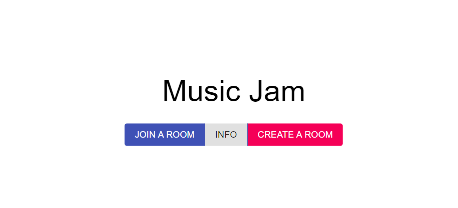
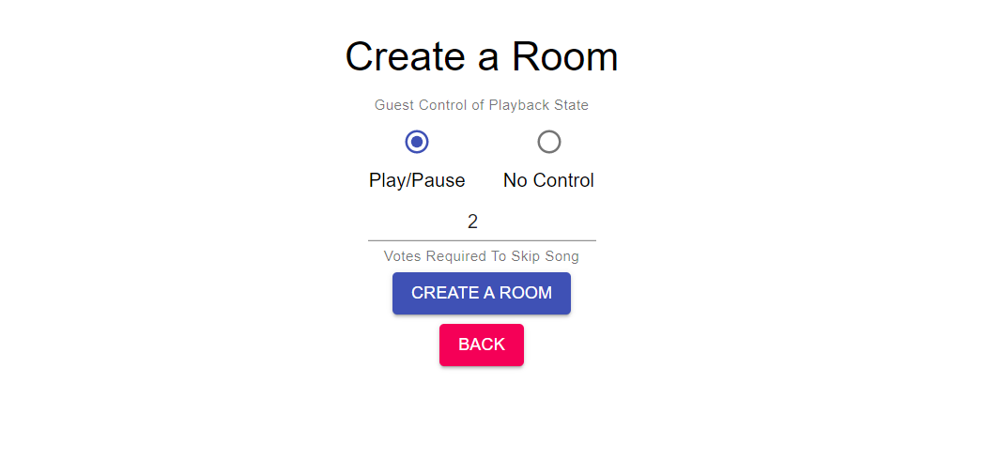
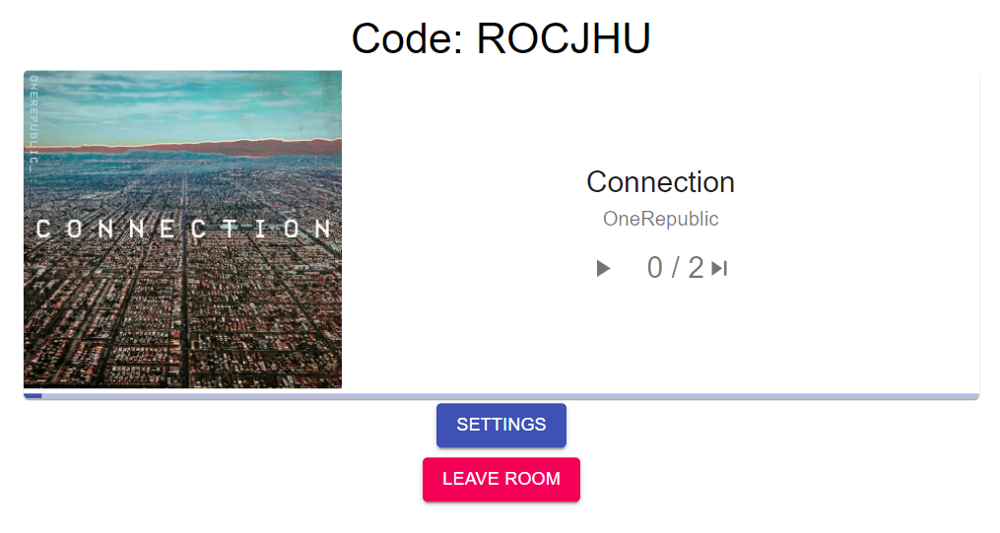
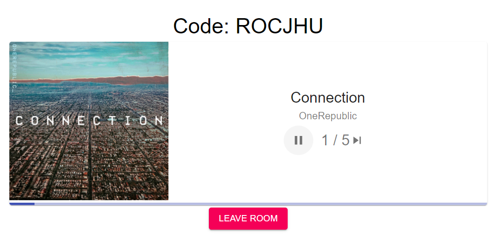

# Music-Controller-App
A Spotify integrated, Music Multiplayer Application built using Django and React. This project is designed to have a Music Jam across a local area network where the Host of the room has Spotify open in their system and the Guests vote on skipping the song and even pausing and playing, if the user gives the control of the playback. This is *not* an application that plays music on the respective browsers of Guests but in turn it plays on the Host's Spotify application which is connected to the browser where it can be connected to a common speaker. There is an API that supports playing in the browser and I might work on that in near future. For now, this application plays music *only* on the Host's Spotify application and it is recommended that the user has a Spotify Premium account to avail full functionality.

## Setup

### Get the source code and install the required modules

```
git clone https://github.com/PradHolla/Music-Controller-App.git

cd Music-Controller-App

pip install -r requirements.txt
```

### Start the web server
```python
python .\manage.py runserver
```

### Node Modules
Before installing the node modules, [Node.js](https://nodejs.org/en/) has to be installed.

Once it is installed, go to the `frontend` folder and install the dependencies:
```
cd frontend

npm i
```

### Compile the Front-End
You can either build the project or run it for development:
```
npm run build

or

npm run dev
```

## Hosting in a LAN
Apart from the hosting with `python ./manage.py runserver`, the server can also be hosted in your Local Area Network. 
Start the web server as:
```python
python .\manage.py runserver 0.0.0.0:8000
```
Before connecting to your web server, you have to include your IP Address in `controller/settings.py` at line 28 under `ALLOWED_HOSTS`. (Enter `ipconfig` to find out your IPV4 Address)

To connect to the server, enter `Your IP Address:8000` in your mobile device.

## Room, Spotify and Music Playback
There are 2 options in the Home Page. `JOIN A ROOM` and `CREATE A ROOM`. The former asks you to enter a previously generated room code and the latter makes you the host of the room and generates a unique room code. Joining a room makes you a guest while Creating one makes you the host. The guest controls can be modified by the Host.

<p align="center">

</p>

##### Note: There has to be a Host before there are Guests in a Room. 

After you select `CREATE A ROOM`, you will be brought into the create page where you can modify `Guest` options. You can either leave it at the default settings or change it to your convenience.

<p align="center">

</p>

Once you modify your settings and proceed, you will be directed to the *Spotify Authentication Page* where you have to login and accept the terms.

If you already have Spotify running in the background and playing a song, your screen will appear like this:

<p align="center">

</p>

If that's not the case, open Spotify and start playing a song. Once again, this is just a Music Controller application as of now. Spotify is not browser integrated and users can only make use of this in a LAN.

The host can also modify the settings for the room. When you select `SETTINGS`, you will be redirected to `Update Room` page where `Play/Pause` settings can be modified and the votes to skip a song can also be updated.

<p align="center">

</p>

When you select `JOIN A ROOM` in the Home Page, the browser asks you to enter the Room Code you want to join.

<p align="center">

</p>

Here, I have entered the code that was generated when I created the Room. When it verifies the code as valid, you are brought to the Room where you are the Guest.

<p align="center">

</p>

As you can see there is no `SETTINGS` option in the Guest Room and also, the Votes to skip a song has been updated to 5 when we changed back in the Host's Room. If 5 members in the room vote to skip a song, the song is skipped. But, the Host can skip a song directly without putting it to vote.

## Conclusion
These are the instructions on how to run this project. In a LAN, this application would be very much fun to use. In the future, I will try to work on the API where the browser itself can play the song so that this Music Jam can be utilized not only on LAN but with also people using this in different remote places altogether.
