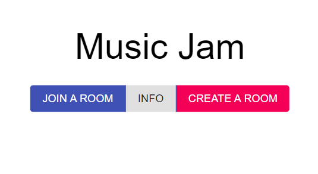
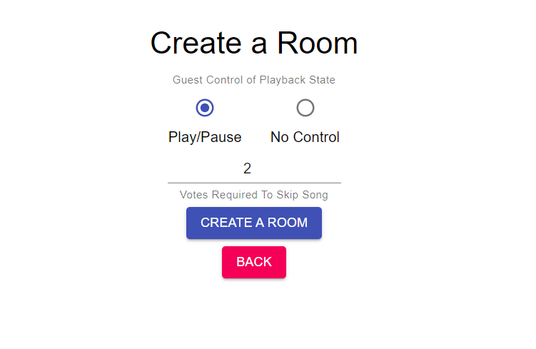
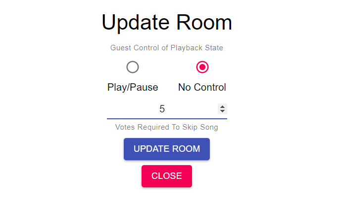

# Music-Controller-App
A Spotify integrated, music multiplayer application using Django and React.

## Setup

### Install the required modules and get the source code

```
pip install -r requirements.txt

git clone https://github.com/PradHolla/Music-Controller-App.git

cd Music-Controller-App
```

### Start the web server
```python
python .\manage.py runserver
```

### Node Modules
Before installing the node modules, [Node.js](https://nodejs.org/en/) has to be installed.

Once it is installed, go to the `frontend` folder and install the dependencies:
```
cd frontend

npm i
```

### Compile the Front-End
You can either build the project or run it for development:
```
npm run build

or

npm run dev
```

## Hosting in a LAN
Apart from the hosting with `python ./manage.py runserver`, the server can also be hosted in your Local Area Network. 
Start the web server as:
```python
python .\manage.py runserver 0.0.0.0:8000
```
Before connecting to your web server, you have to include your IP Address in `controller/settings.py` at line 28 under `ALLOWED_HOSTS`. (Enter `ipconfig` to find out your IPV4 Address)

To connect to the server, enter `Your IP Address:8000` in your mobile device.

## Spotify
There are 2 options in the Home Page. `JOIN A ROOM` and `CREATE A ROOM`. The former asks you to enter a previously generated room code and the latter makes you the host of the room and generates a unique room code. Joining a room makes you a guest while Creating one makes you the host. The guest controls can be modified by the Host.

<p align="center">

</p>

##### Note: There has to be a Host before there are Guests in a Room. 

After you select `CREATE A ROOM`, you will be brought into the create page where you can modify `Guest` options. You can either leave it at the default settings or change it to your convenience.

<p align="center">

</p>

Once you modify your settings and proceed, you will be directed to the *Spotify Authentication Page* where you have to login and accept the terms.

If you already have Spotify running in the background and playing a song, your screen will appear like this:

<p align="center">

</p>

If that's not the case, open Spotify and start playing a song. Once again, this is just a Music Controller application as of now. Spotify is not browser integrated and users can only make use of this in a LAN.

The host can also modify the settings for the room. When you select `SETTINGS`, you will be redirected to `Update Room` page where `Play/Pause` settings can be modified and the votes to skip a song can also be updated.

<p align="center">

</p>
